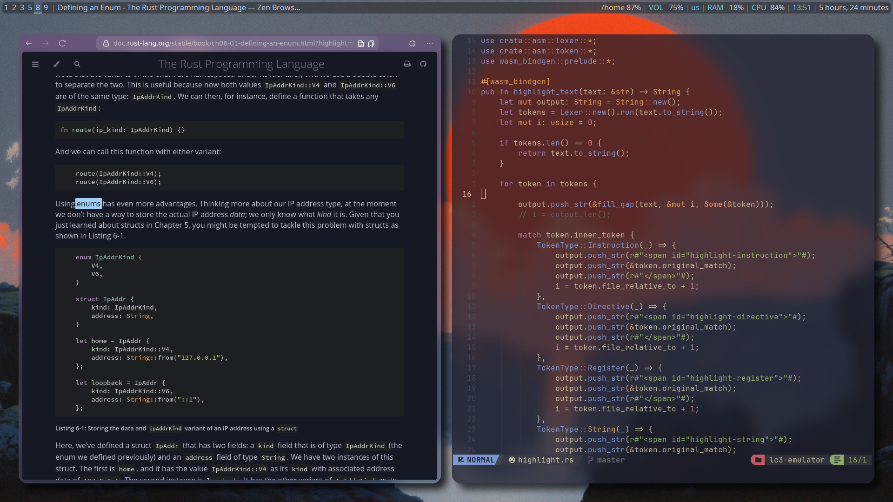

# i3 config

My current, minimal i3 config.





## ENSURE INSTALLED
 * [`picom`](https://github.com/yshui/picom) - for prettiness
 * [`nitrogen`](https://github.com/nitrogen/nitrogen) - for wallpapers
 * [`rofi`](https://github.com/davatorium/rofi) - for launching apps
 * [`polybar`](https://github.com/polybar/polybar) - i3bar replacement
 * [`zen`](https://flathub.org/apps/app.zen_browser.zen) - A better browser than Firefox (the flatpak, by default)
 * [`ghostty`](https://ghostty.org/) - A simple, yet powerful, terminal.

## SETUP
**Warning: Make sure to back up of any existing i3, polybar, picom, or ghostty dotfiles** 

### 1. Install
Clone this repository into `~/.config/i3/`.

```zsh
rm -r ~/.config/i3 # BE CAREFUL! BACKUP FIRST!!!
git clone https://github.com/ChristianStout/i3-config.git ~/.config/i3
```

### 2. Polybar
Then, make sure there is a symbolic link from the polybar configuration
to the `polybar` configuration file.

```zsh
mkdir ~/.config/polybar
ln -s ~/.config/i3/polybar.ini ~/.config/polybar/config.ini
```

### 3. Picom
Repeat for `picom` to make everything feel *fluid*.

```zsh
mkdir ~/.config/picom
ln -s ~/.config/i3/picom.conf ~/.config/picom/picom.conf
```

### 4. Rofi **(Optional)**
Install the rofi theme
```zsh
cp ~/.config/i3/rofi-theme/rounded-common.rasi ~/.local/share/rofi/themes/rounded-common.rasi
cp ~/.config/i3/rofi-theme/rounded-catppuccin-mocha.rasi ~/.local/share/rofi/themes/rounded-catppuccin-mocha.rasi
```

Then run
```zsh
rofi-theme-selector
```
and search `rounded-catppuccin-mocha`. Press `alt + a` to select it.

Alternatively, just run the theme selector and do whatever you want.

### 5. Ghostty **(Optional)**
**Optionally**, you can add a symbolic link to the ghostty configuration.
If you already have a config, and would like to try mine, run:
```zsh
mv ~/.config/ghostty/config ~/.config/ghostty/config.bak
ln -s ~/.config/i3/ghostty.conf ~/.config/ghostty/config
```
Or if you don't have a config, or just want to use mine.
```zsh
rm -rf ~/.config/ghostty/ && mkdir ~/.config/ghostty
ln -s ~/.config/i3/ghostty.config ~/.config/ghostty/config
```

## Before Use
Make sure to adjust a few things before use:

### Monitor
By default, `xrandr` will attempt to run your montitor
at `1080p` and `144hz`. 

Make sure to run `xrandr` to learn information
about your sapecific monitor. Modify the `xrandr`
line at the bottom of the `config` file accoringly
before use.

### Terminal
The default terminal is `ghostty`. Either make sure
it is installed, or change it to your liking.

### Compositor
Make sure that `picom` is compiled from
the repository. Alternatively, install it
from your package manager, and uncomment the
line that calls `picom` from PATH.

### Web browser
The default browser is `zen`. Either change this in the
`config` file before use, or ensure that `zen` is installed
FROM THE **FLATPAK**.
Or you can change to your favorite browser ;)

## Use

### Custom Keybindings
 * `ALT+ENTER` -> Launch `ghostty`
 * `ALT+b` -> Launch `zen`
 * `ALT+q` -> Close window
 * `ALT+h` -> Move focus left
 * `ALT+j` -> Move focus down
 * `ALT+k` -> Move focus up
 * `ALT+l` -> Move focus right
 * `ALT+SHIFT+h` -> Move window left
 * `ALT+SHIFT+j` -> Move window down
 * `ALT+SHIFT+k` -> Move window up
 * `ALT+SHIFT+l` -> Move window right

If the Flatpak version of the Godot game engine is installed:
 * `ALT+g` -> Launch `godot`

Hope you enjoy it as much as I do :)

